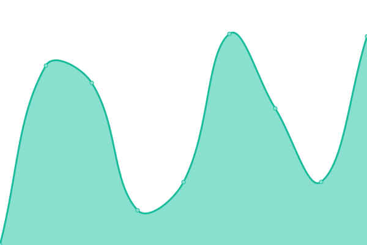
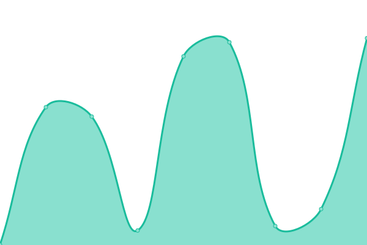
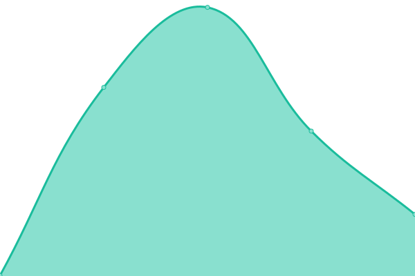
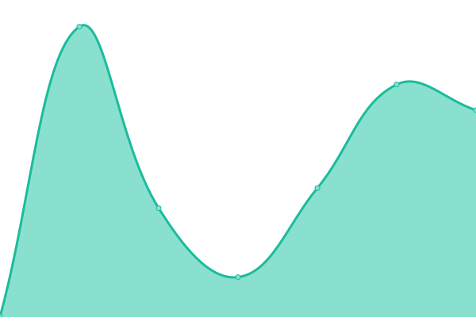

# [📈 Live Status](https://status.fashionunited.com): <!--live status--> **🟧 Partial outage**

This repository contains the open-source uptime monitor and status page for [FashionUnited](https://fashionunited.info), powered by [Upptime](https://github.com/upptime/upptime).

With [Upptime](https://upptime.js.org), you can get your own unlimited and free uptime monitor and status page, powered entirely by a GitHub repository. We use [Issues](https://github.com/fuww/status.fashionunited.com/issues) as incident reports, [Actions](https://github.com/fuww/status.fashionunited.com/actions) as uptime monitors, and [Pages](https://status.fashionunited.com) for the status page.

<!--start: status pages-->
<!-- This summary is generated by Upptime (https://github.com/upptime/upptime) -->
<!-- Do not edit this manually, your changes will be overwritten -->
<!-- prettier-ignore -->
| URL | Status | History | Response Time | Uptime |
| --- | ------ | ------- | ------------- | ------ |
|  [fashionunited.com](https://fashionunited.com) | 🟩 Up | [fashionunited-com.yml](https://github.com/fuww/status.fashionunited.com/commits/HEAD/history/fashionunited-com.yml) | 

 166ms
     
 | 

<a href="https://status.fashionunited.com/history/fashionunited-com">100.00%</a>
    

|  [fashionunited.info](https://fashionunited.info) | 🟩 Up | [fashionunited-info.yml](https://github.com/fuww/status.fashionunited.com/commits/HEAD/history/fashionunited-info.yml) | 

 679ms
     
 | 

<a href="https://status.fashionunited.com/history/fashionunited-info">100.00%</a>
    

|  [developer.fashionunited.com](https://developer.fashionunited.com) | 🟩 Up | [developer-fashionunited-com.yml](https://github.com/fuww/status.fashionunited.com/commits/HEAD/history/developer-fashionunited-com.yml) | 

 448ms
     
 | 

<a href="https://status.fashionunited.com/history/developer-fashionunited-com">85.16%</a>
    

|  [dashboard.fashionunited.com](https://dashboard.fashionunited.com) | 🟩 Up | [dashboard-fashionunited-com.yml](https://github.com/fuww/status.fashionunited.com/commits/HEAD/history/dashboard-fashionunited-com.yml) | 

 315ms
     
 | 

<a href="https://status.fashionunited.com/history/dashboard-fashionunited-com">100.00%</a>
    

|  [fashionunited.at](https://fashionunited.at) | 🟩 Up | [fashionunited-at.yml](https://github.com/fuww/status.fashionunited.com/commits/HEAD/history/fashionunited-at.yml) | 

 835ms
     
 | 

<a href="https://status.fashionunited.com/history/fashionunited-at">100.00%</a>
    

|  [fashionunited.be](https://fashionunited.be) | 🟩 Up | [fashionunited-be.yml](https://github.com/fuww/status.fashionunited.com/commits/HEAD/history/fashionunited-be.yml) | 

 763ms
     
 | 

<a href="https://status.fashionunited.com/history/fashionunited-be">100.00%</a>
    

|  [fashionunited.ca](https://fashionunited.ca) | 🟩 Up | [fashionunited-ca.yml](https://github.com/fuww/status.fashionunited.com/commits/HEAD/history/fashionunited-ca.yml) | 

 553ms
     
 | 

<a href="https://status.fashionunited.com/history/fashionunited-ca">100.00%</a>
    

|  [fashionunited.ch](https://fashionunited.ch) | 🟩 Up | [fashionunited-ch.yml](https://github.com/fuww/status.fashionunited.com/commits/HEAD/history/fashionunited-ch.yml) | 

 557ms
     
 | 

<a href="https://status.fashionunited.com/history/fashionunited-ch">100.00%</a>
    

|  [fashionunited.cl](https://fashionunited.cl) | 🟩 Up | [fashionunited-cl.yml](https://github.com/fuww/status.fashionunited.com/commits/HEAD/history/fashionunited-cl.yml) | 

 812ms
     
 | 

<a href="https://status.fashionunited.com/history/fashionunited-cl">100.00%</a>
    

|  [FashionUnited.cn](https://fashionunited.cn) | 🟩 Up | [fashion-united-cn.yml](https://github.com/fuww/status.fashionunited.com/commits/HEAD/history/fashion-united-cn.yml) | 

 1048ms
     
 | 

<a href="https://status.fashionunited.com/history/fashion-united-cn">100.00%</a>
    

|  [fashionunited.co](https://fashionunited.co) | 🟩 Up | [fashionunited-co.yml](https://github.com/fuww/status.fashionunited.com/commits/HEAD/history/fashionunited-co.yml) | 

 781ms
     
 | 

<a href="https://status.fashionunited.com/history/fashionunited-co">100.00%</a>
    

|  [fashionunited.com.ar](https://fashionunited.com.ar) | 🟩 Up | [fashionunited-com-ar.yml](https://github.com/fuww/status.fashionunited.com/commits/HEAD/history/fashionunited-com-ar.yml) | 

 779ms
     
 | 

<a href="https://status.fashionunited.com/history/fashionunited-com-ar">100.00%</a>
    

|  [fashionunited.com.br](https://fashionunited.com.br) | 🟩 Up | [fashionunited-com-br.yml](https://github.com/fuww/status.fashionunited.com/commits/HEAD/history/fashionunited-com-br.yml) | 

 725ms
     
 | 

<a href="https://status.fashionunited.com/history/fashionunited-com-br">100.00%</a>
    

|  [fashionunited.com.pe](https://fashionunited.com.pe) | 🟩 Up | [fashionunited-com-pe.yml](https://github.com/fuww/status.fashionunited.com/commits/HEAD/history/fashionunited-com-pe.yml) | 

 907ms
     
 | 

<a href="https://status.fashionunited.com/history/fashionunited-com-pe">100.00%</a>
    

|  [FashionUnited.de](https://fashionunited.de) | 🟩 Up | [fashion-united-de.yml](https://github.com/fuww/status.fashionunited.com/commits/HEAD/history/fashion-united-de.yml) | 

 396ms
     
 | 

<a href="https://status.fashionunited.com/history/fashion-united-de">100.00%</a>
    

|  [FashionUnited.es](https://fashionunited.es) | 🟩 Up | [fashion-united-es.yml](https://github.com/fuww/status.fashionunited.com/commits/HEAD/history/fashion-united-es.yml) | 

 317ms
     
 | 

<a href="https://status.fashionunited.com/history/fashion-united-es">100.00%</a>
    

|  [FashionUnited.fr](https://fashionunited.fr) | 🟩 Up | [fashion-united-fr.yml](https://github.com/fuww/status.fashionunited.com/commits/HEAD/history/fashion-united-fr.yml) | 

 645ms
     
 | 

<a href="https://status.fashionunited.com/history/fashion-united-fr">100.00%</a>
    

|  [FashionUnited.in](https://fashionUnited.in) | 🟩 Up | [fashion-united-in.yml](https://github.com/fuww/status.fashionunited.com/commits/HEAD/history/fashion-united-in.yml) | 

 668ms
     
 | 

<a href="https://status.fashionunited.com/history/fashion-united-in">100.00%</a>
    

|  [FashionUnited.info](https://fashionunited.info) | 🟩 Up | [fashion-united-info.yml](https://github.com/fuww/status.fashionunited.com/commits/HEAD/history/fashion-united-info.yml) | 

 434ms
     
 | 

<a href="https://status.fashionunited.com/history/fashion-united-info">100.00%</a>
    

|  [FashionUnited.it](https://fashionunited.it) | 🟩 Up | [fashion-united-it.yml](https://github.com/fuww/status.fashionunited.com/commits/HEAD/history/fashion-united-it.yml) | 

 645ms
     
 | 

<a href="https://status.fashionunited.com/history/fashion-united-it">100.00%</a>
    

|  [fashionunited.jp](https://fashionunited.jp) | 🟩 Up | [fashionunited-jp.yml](https://github.com/fuww/status.fashionunited.com/commits/HEAD/history/fashionunited-jp.yml) | 

 519ms
     
 | 

<a href="https://status.fashionunited.com/history/fashionunited-jp">100.00%</a>
    

|  [fashionunited.mx](https://fashionunited.mx) | 🟩 Up | [fashionunited-mx.yml](https://github.com/fuww/status.fashionunited.com/commits/HEAD/history/fashionunited-mx.yml) | 

 604ms
     
 | 

<a href="https://status.fashionunited.com/history/fashionunited-mx">100.00%</a>
    

|  [FashionUnited.nl](https://fashionunited.nl) | 🟩 Up | [fashion-united-nl.yml](https://github.com/fuww/status.fashionunited.com/commits/HEAD/history/fashion-united-nl.yml) | 

 615ms
     
 | 

<a href="https://status.fashionunited.com/history/fashion-united-nl">100.00%</a>
    

|  [fashionunited.nz](https://fashionunited.nz) | 🟩 Up | [fashionunited-nz.yml](https://github.com/fuww/status.fashionunited.com/commits/HEAD/history/fashionunited-nz.yml) | 

 925ms
     
 | 

<a href="https://status.fashionunited.com/history/fashionunited-nz">100.00%</a>
    

|  [FashionUnited.ru](https://fashionunited.ru) | 🟩 Up | [fashion-united-ru.yml](https://github.com/fuww/status.fashionunited.com/commits/HEAD/history/fashion-united-ru.yml) | 

 380ms
     
 | 

<a href="https://status.fashionunited.com/history/fashion-united-ru">100.00%</a>
    

|  [fashionunited.uk](https://fashionunited.uk) | 🟩 Up | [fashionunited-uk.yml](https://github.com/fuww/status.fashionunited.com/commits/HEAD/history/fashionunited-uk.yml) | 

 633ms
     
 | 

<a href="https://status.fashionunited.com/history/fashionunited-uk">100.00%</a>
    

|  [fashionweekweb.com](https://fashionweekweb.com) | 🟩 Up | [fashionweekweb-com.yml](https://github.com/fuww/status.fashionunited.com/commits/HEAD/history/fashionweekweb-com.yml) | 

 747ms
     
 | 

<a href="https://status.fashionunited.com/history/fashionweekweb-com">100.00%</a>
    

|  [internationalfashionjobs.com](https://internationalfashionjobs.com) | 🟩 Up | [internationalfashionjobs-com.yml](https://github.com/fuww/status.fashionunited.com/commits/HEAD/history/internationalfashionjobs-com.yml) | 

 715ms
     
 | 

<a href="https://status.fashionunited.com/history/internationalfashionjobs-com">100.00%</a>
    

|  [Google](https://www.google.com) | 🟩 Up | [google.yml](https://github.com/fuww/status.fashionunited.com/commits/HEAD/history/google.yml) | 

 113ms
     
 | 

<a href="https://status.fashionunited.com/history/google">100.00%</a>
    

|  [Wikipedia](https://en.wikipedia.org) | 🟩 Up | [wikipedia.yml](https://github.com/fuww/status.fashionunited.com/commits/HEAD/history/wikipedia.yml) | 

 145ms
     
 | 

<a href="https://status.fashionunited.com/history/wikipedia">100.00%</a>
    

|  [Hacker News](https://news.ycombinator.com) | 🟩 Up | [hacker-news.yml](https://github.com/fuww/status.fashionunited.com/commits/HEAD/history/hacker-news.yml) | 

 341ms
     
 | 

<a href="https://status.fashionunited.com/history/hacker-news">100.00%</a>
    

|  [Test Broken Site](https://thissitedoesnotexist.koj.co) | 🟥 Down | [test-broken-site.yml](https://github.com/fuww/status.fashionunited.com/commits/HEAD/history/test-broken-site.yml) | 

 0ms
     
 | 

<a href="https://status.fashionunited.com/history/test-broken-site">100.00%</a>
    

<!--end: status pages-->

[**Visit our status website →**](https://status.fashionunited.com)

## 📄 License

- Powered by: [Upptime](https://github.com/upptime/upptime)
- Code: [MIT](./LICENSE) © [FashionUnited](https://fashionunited.info)
- Data in the `./history` directory: [Open Database License](https://opendatacommons.org/licenses/odbl/1-0/)
