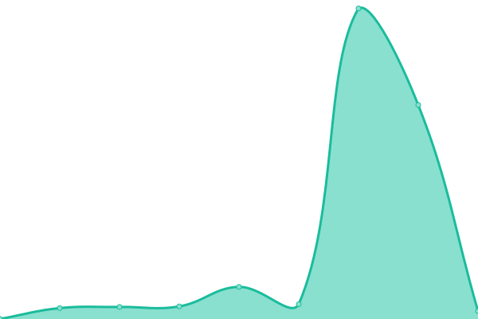

# [📈 Live Status](https://status.fashionunited.com): <!--live status--> **🟧 Partial outage**

This repository contains the open-source uptime monitor and status page for [FashionUnited](https://fashionunited.info), powered by [Upptime](https://github.com/upptime/upptime).

With [Upptime](https://upptime.js.org), you can get your own unlimited and free uptime monitor and status page, powered entirely by a GitHub repository. We use [Issues](https://github.com/fuww/status.fashionunited.com/issues) as incident reports, [Actions](https://github.com/fuww/status.fashionunited.com/actions) as uptime monitors, and [Pages](https://status.fashionunited.com) for the status page.

<!--start: status pages-->
<!-- This summary is generated by Upptime (https://github.com/upptime/upptime) -->
<!-- Do not edit this manually, your changes will be overwritten -->
<!-- prettier-ignore -->
| URL | Status | History | Response Time | Uptime |
| --- | ------ | ------- | ------------- | ------ |
|  [fashionunited.com](https://fashionunited.com) | 🟩 Up | [fashionunited-com.yml](https://github.com/fuww/status.fashionunited.com/commits/HEAD/history/fashionunited-com.yml) | 

 227ms
     
 | 

<a href="https://status.fashionunited.com/history/fashionunited-com">100.00%</a>
    

|  [fashionunited.info](https://fashionunited.info) | 🟩 Up | [fashionunited-info.yml](https://github.com/fuww/status.fashionunited.com/commits/HEAD/history/fashionunited-info.yml) | 

 736ms
     
 | 

<a href="https://status.fashionunited.com/history/fashionunited-info">100.00%</a>
    

|  [developer.fashionunited.com](https://developer.fashionunited.com) | 🟥 Down | [developer-fashionunited-com.yml](https://github.com/fuww/status.fashionunited.com/commits/HEAD/history/developer-fashionunited-com.yml) | 

 0ms
     
 | 

<a href="https://status.fashionunited.com/history/developer-fashionunited-com">0.00%</a>
    

|  [dashboard.fashionunited.com](https://dashboard.fashionunited.com) | 🟩 Up | [dashboard-fashionunited-com.yml](https://github.com/fuww/status.fashionunited.com/commits/HEAD/history/dashboard-fashionunited-com.yml) | 

 221ms
     
 | 

<a href="https://status.fashionunited.com/history/dashboard-fashionunited-com">100.00%</a>
    

|  [fashionunited.at](https://fashionunited.at) | 🟩 Up | [fashionunited-at.yml](https://github.com/fuww/status.fashionunited.com/commits/HEAD/history/fashionunited-at.yml) | 

 370ms
     
 | 

<a href="https://status.fashionunited.com/history/fashionunited-at">100.00%</a>
    

|  [fashionunited.be](https://fashionunited.be) | 🟩 Up | [fashionunited-be.yml](https://github.com/fuww/status.fashionunited.com/commits/HEAD/history/fashionunited-be.yml) | 

 697ms
     
 | 

<a href="https://status.fashionunited.com/history/fashionunited-be">100.00%</a>
    

|  [fashionunited.ca](https://fashionunited.ca) | 🟩 Up | [fashionunited-ca.yml](https://github.com/fuww/status.fashionunited.com/commits/HEAD/history/fashionunited-ca.yml) | 

 376ms
     
 | 

<a href="https://status.fashionunited.com/history/fashionunited-ca">100.00%</a>
    

|  [fashionunited.ch](https://fashionunited.ch) | 🟩 Up | [fashionunited-ch.yml](https://github.com/fuww/status.fashionunited.com/commits/HEAD/history/fashionunited-ch.yml) | 

 172ms
     
 | 

<a href="https://status.fashionunited.com/history/fashionunited-ch">100.00%</a>
    

|  [fashionunited.cl](https://fashionunited.cl) | 🟩 Up | [fashionunited-cl.yml](https://github.com/fuww/status.fashionunited.com/commits/HEAD/history/fashionunited-cl.yml) | 

 650ms
     
 | 

<a href="https://status.fashionunited.com/history/fashionunited-cl">100.00%</a>
    

|  [Google](https://www.google.com) | 🟩 Up | [google.yml](https://github.com/fuww/status.fashionunited.com/commits/HEAD/history/google.yml) | 

 56ms
     
 | 

<a href="https://status.fashionunited.com/history/google">100.00%</a>
    

|  [Wikipedia](https://en.wikipedia.org) | 🟩 Up | [wikipedia.yml](https://github.com/fuww/status.fashionunited.com/commits/HEAD/history/wikipedia.yml) | 

 230ms
     
 | 

<a href="https://status.fashionunited.com/history/wikipedia">100.00%</a>
    

|  [Hacker News](https://news.ycombinator.com) | 🟩 Up | [hacker-news.yml](https://github.com/fuww/status.fashionunited.com/commits/HEAD/history/hacker-news.yml) | 

 431ms
     
 | 

<a href="https://status.fashionunited.com/history/hacker-news">100.00%</a>
    

|  [Test Broken Site](https://thissitedoesnotexist.koj.co) | 🟥 Down | [test-broken-site.yml](https://github.com/fuww/status.fashionunited.com/commits/HEAD/history/test-broken-site.yml) | 

 0ms
     
 | 

<a href="https://status.fashionunited.com/history/test-broken-site">100.00%</a>
    

<!--end: status pages-->

[**Visit our status website →**](https://status.fashionunited.com)

## 📄 License

- Powered by: [Upptime](https://github.com/upptime/upptime)
- Code: [MIT](./LICENSE) © [FashionUnited](https://fashionunited.info)
- Data in the `./history` directory: [Open Database License](https://opendatacommons.org/licenses/odbl/1-0/)
